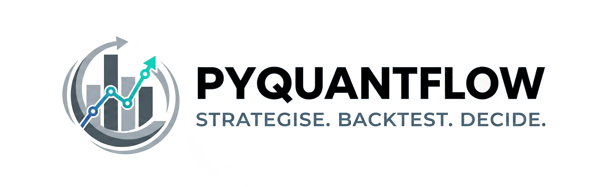

# pyquantflow

**Strategise. Backtest. Decide.**

A local-first stock analysis and backtesting framework designed for data persistence and strategy validation. Built on top of `yfinance` and `backtesting.py`, it gives you control over your data and your strategies. Further, it bridges the gap between simple technical analysis and Financial Machine Learning.

## Key Features
| Feature      | Description                                                                 |
|--------------|-----------------------------------------------------------------------------|
| Local-First  | SQLite-backed data persistence for lightning-fast local access.             |
| Adv. Fin. ML | Implements Triple-Barrier labeling, Purged Cross-Validation, etc..             |
| MLOps        | Integrated hyperparameter optimisation via Optuna and tracking via MLflow.  |
| Vectorized   | Built on yfinance, TA‑Lib, and backtesting.py.                              |


## Installation

```bash
pip install git+https://github.com/Vespertili0/pyquantflow.git
```

## Quick Start

### 1. Setup Stock Database

Initialize your local SQLite database and fetch historical data for your favorite tickers using '[yfinance]'(https://github.com/ranaroussi/yfinance) in the background.

```python
from pyquantflow.data.database import DatabaseManager

db = DatabaseManager('example_stocks.db')
db.add_ticker('AAPL', start_year=2023, interval='1d')

data = db.get_data('AAPL')
```

### 2. Add Indicator via pandas-pipe

Compute talib indicators or talib-style indicators provided (e.g. Ichimoku cloud) and add them directly to the OHLCV-dataframe of a ticker using the `pandas-pipe` wrapper for clean, readable indicator chains.

```python
from pyquantflow.data.utils import pipe_indicator
from pyquantflow.data.features.indicator import ICHIMOKU
import talib

data_indicator = (
    data.pipe(
        pipe_indicator, 
        indicator=ICHIMOKU,
        input_map={'high': 'High', 'low': 'Low', 'close': 'Close'},
        output_names=[
            'Tenkan', 'Kijun', 
            'SpanA_Projected', 'SpanB_Projected', 
            'SpanA_Live', 'SpanB_Live', 
            'Chikou'
        ]
    )
    .pipe(
        pipe_indicator, 
        indicator=talib.EMA,
        input_map={'real': 'Close'},
        output_names=['EMA_120'],
        **{'timeperiod': 120}
    )
)
```

### 3. Integrate Financial ML Concepts

Train ML-models following concepts introduced by *Marcos Lopez de Prado's* book "Advances in Financial Machine Learning" (2018), utilising target labeling (e.g. trend-scan, triple-barrier), feature engineering (e.g. fractional differentiation), and purged cross-validation. Using ['optuna'](https://github.com/optuna/optuna), hyperparameters of the ML-models are optimised and the final model is logged to ['mlflow'](https://github.com/mlflow/mlflow) via a modern MLOps workflow.

```python

from pyquantflow.data.labels.triple_barrier import apply_triple_barrier

from pyquantflow.model.cross_validation import PurgedKFoldCV
from pyquantflow.model.training import HyperparameterOptimiser
from pyquantflow.model.manager import ClassifierEngine

# 1. Apply Triple-Barrier Labeling
# Defines horizontal (Profit/Loss) and vertical (Time) barriers
data['label'] = apply_triple_barrier(
    data.Close, 
    sl_col=data.Close * 0.98, # 2% Stop Loss
    tp_mult=3,               # 3x Risk/Reward
    horizon=10               # 10-bar limit
)

# 2. MLOps Workflow
# Integrate PurgedKFoldCV to handle serial correlation in time-series data
# ce.run_pipeline(..., cv=PurgedKFoldCV())

```

### 4. Run Statistical-Backtesting

*(in development)*

### 5. Run Event-Backtesting

#### 5.1 Run Single Backtest

Test trading strategies w/o ML-models using the built-in engine wrapping the ['backtesting.py'](https://github.com/kernc/backtesting.py) package.

```python
from pyquantflow.backtesting.engine import BacktestRunner
from pyquantflow.strategies.example_strategy import SmaCross
from pyquantflow.data.database import DatabaseManager

# Get data
db = DatabaseManager('example_stocks.db')
data = db.get_data('AAPL')

# Run backtest
runner = BacktestRunner()
# Note: Ensure data is not empty before running backtest
if not data.empty:
    results = runner.run(SmaCross, data, symbol='AAPL', cash=10000, commission=.002)
    print(f"Return: {results['AAPL']['Return [%]']:.2f}%")
else:
    print("No data available for backtest.")
```

#### 5.2. Run Batch Event-Backtesting with Result Persistence

Run backtests for multiple tickers and save results to a SQLite database.

```python
from pyquantflow.backtesting.batchbacktest import BatchBacktester
from pyquantflow.strategies.example_strategy import SmaCross
from pyquantflow.data.database import DatabaseManager

# Get data for multiple tickers
db = DatabaseManager('example_stocks.db')
tickers = ['AAPL', 'MSFT']
data_map = {}
for ticker in tickers:
    data = db.get_data(ticker)
    if not data.empty:
        data_map[ticker] = data

# Run batch backtest
# results will be saved to 'backtest_results.db' by default
backtester = BatchBacktester(results_db_path='backtest_results.db')
results = backtester.run_batch_backtest(data_map, SmaCross, cash=10000, commission=.002)

print("Average Metrics:", results['average_metrics'])
```
