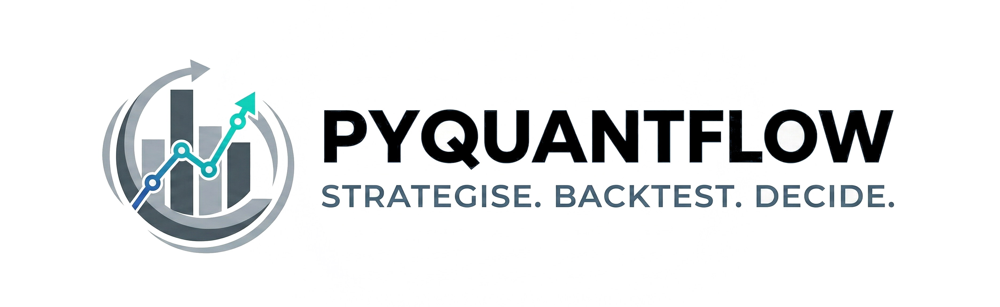

<p align="center">
  <a href="https://github.com/Vespertili0/pyquantflow/releases">
    
  </a>
  <a href="https://www.python.org/">
    
  </a>
  <a href="https://github.com/Vespertili0/pyquantflow/actions/workflows/tests.yml">
    
  </a>
  <a href="https://codecov.io/gh/Vespertili0/pyquantflow">
    
  </a>
</p>

# pyquantflow

A local-first stock analysis and backtesting framework designed for data persistence and strategy validation. Built on top of `yfinance` and `backtesting.py`, it gives you control over your data and your strategies. Further, it bridges the gap between simple technical analysis and Financial Machine Learning.

## Key Features
| Feature      | Description                                                                 |
|--------------|-----------------------------------------------------------------------------|
| Local-First  | SQLite-backed data persistence for lightning-fast local access.             |
| Adv. Fin. ML | Implements Triple-Barrier labelling, Purged Cross-Validation, etc..             |
| MLOps        | Integrated hyperparameter optimisation via Optuna and tracking via MLflow.  |
| Vectorised   | Built on yfinance, TA‑Lib, and backtesting.py.                              |


## Installation

```bash
pip install git+https://github.com/Vespertili0/pyquantflow.git
```

## Quick Start

### 1. Setup Stock Database

Initialise your local SQLite database and fetch historical data for your favourite tickers using [`yfinance`](https://github.com/ranaroussi/yfinance) in the background.

```python
from pyquantflow.data.database import DatabaseManager

db = DatabaseManager("example_stocks.db")
db.add_ticker("AAPL", start_year=2023, interval="1d")

data = db.get_data("AAPL")
```

### 2. Add Indicator via pandas-pipe

Compute talib indicators or talib-style indicators provided (e.g. Ichimoku cloud) and add them directly to the OHLCV-dataframe of a ticker using the `pandas-pipe` wrapper for clean, readable indicator chains.

```python
from pyquantflow.data.utils import pipe_indicator
from pyquantflow.data.features.indicator import ICHIMOKU
import talib

data_indicator = data.pipe(
    pipe_indicator,
    indicator=ICHIMOKU,
    input_map={"high": "High", "low": "Low", "close": "Close"},
    output_names=[
        "Tenkan",
        "Kijun",
        "SpanA_Projected",
        "SpanB_Projected",
        "SpanA_Live",
        "SpanB_Live",
        "Chikou",
    ],
).pipe(
    pipe_indicator,
    indicator=talib.EMA,
    input_map={"real": "Close"},
    output_names=["EMA_120"],
    **{"timeperiod": 120}
)
```

### 3. Integrate Financial ML Concepts

Train ML-models following concepts introduced by *Marcos Lopez de Prado's* book "Advances in Financial Machine Learning" (2018), utilising target labelling (e.g. trend-scan, triple-barrier), feature engineering (e.g. fractional differentiation), and purged cross-validation. Using [`optuna`](https://github.com/optuna/optuna), hyperparameters of the ML-models are optimised and the final model is logged to [`mlflow`](https://github.com/mlflow/mlflow) via a modern MLOps workflow.

```python
from pyquantflow.data.assetorganiser import AssetOrganiser
from pyquantflow.data.labels.factory import TripleBarrierLabelFactory
from pyquantflow.model.training import HyperparameterOptimiser
from pyquantflow.model.manager import ClassifierEngine

# 1. Define the Labelling Strategy
label_factory = TripleBarrierLabelFactory(pt_mult=3.0, sl_mult=2.0, horizon=10)

# 2. Initialise the Asset Organiser
# We assume data_map is a dict of ticker: dataframe
organiser = AssetOrganiser(
    data_map=data_map,
    cutoff_date="2023-01-01",
    target_features=["label"],
    label_factory=label_factory,
)

# 3. Build the Learning Pipeline
# This strictly orchestrates:
#   a) Continuous Label Generation
#   b) Dynamic CUSUM Down-sampling
#   c) Sample Weighting via Concurrency
organiser.prepare_multi_asset_frame()
calibrated_alphas = organiser.build_learning_pipeline(
    target_events_train=1000, price_col="Close"
)

# 4. Extract Payload for MLOps Engine
payload = organiser.get_classifierengine_payload(features=["Close", "EMA_120"])

# 5. Run MLOps Workflow
engine = ClassifierEngine(optimiser=HyperparameterOptimiser(study_name="example"))
# engine.run_pipeline(**payload, balance_classes=True, ...)
```

### 4. Run Statistical-Backtesting

*(in development)*

### 5. Run Event-Backtesting

#### 5.1 Run Single Backtest

Test trading strategies w/o ML-models using the built-in engine wrapping the [`backtesting.py`](https://github.com/kernc/backtesting.py) package.

```python
from pyquantflow.backtesting.batchbacktest import BatchBacktester
from pyquantflow.strategies.example_strategy import SmaCross
from pyquantflow.data.database import DatabaseManager

# Get data
db = DatabaseManager("example_stocks.db")
data = db.get_data("AAPL")

# Run backtest
backtester = BatchBacktester()
# Note: Ensure data is not empty before running backtest
if not data.empty:
    results = backtester.run_single_backtest(
        df=data,
        strategy_class=SmaCross,
        cash=10000,
        commission=0.002,
        trade_on_close=False,
        finalize_trades=True,
    )
    print(f"Return: {results['Return [%]']:.2f}%")
else:
    print("No data available for backtest.")
```

#### 5.2. Run Batch Event-Backtesting with Result Persistence

Run backtests for multiple tickers and save results to a SQLite database.

```python
from pyquantflow.backtesting.batchbacktest import BatchBacktester
from pyquantflow.strategies.example_strategy import SmaCross
from pyquantflow.data.database import DatabaseManager

# Get data for multiple tickers
db = DatabaseManager("example_stocks.db")
tickers = ["AAPL", "MSFT"]
data_map = {}
for ticker in tickers:
    data = db.get_data(ticker)
    if not data.empty:
        data_map[ticker] = data

# Run batch backtest
# results can be saved to 'backtest_results.db' by calling save_batch_results()
backtester = BatchBacktester(results_db_path="backtest_results.db")
avg_metrics = backtester.run_batch_backtest(
    strategy_class=SmaCross, data=data_map, cash=10000, commission=0.002
)
backtester.save_batch_results()

print("Average Metrics:", avg_metrics)
```
